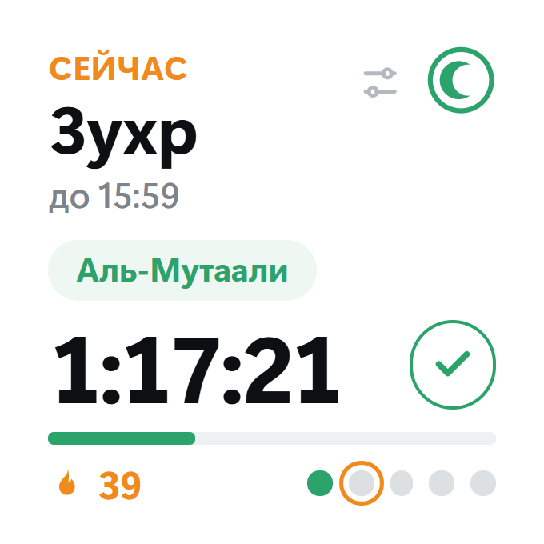
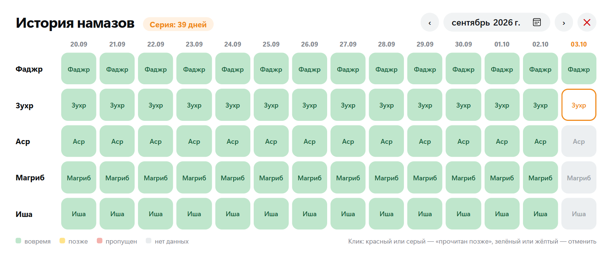
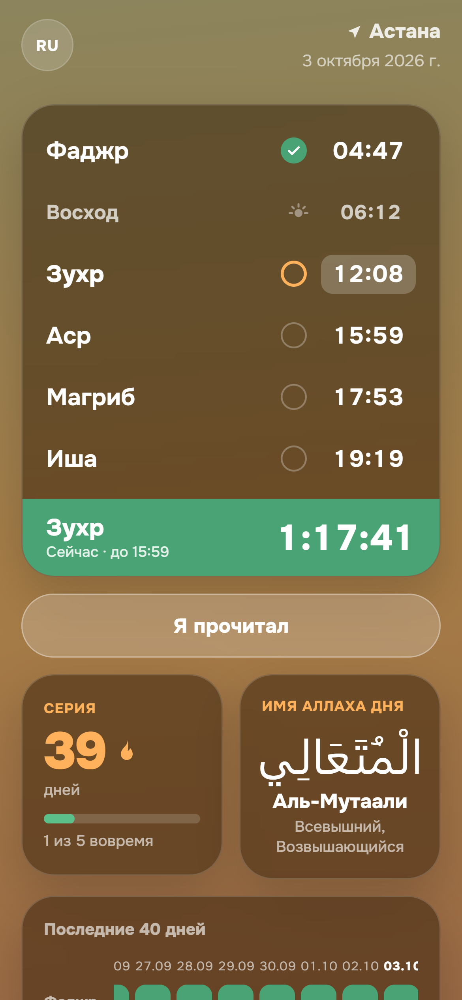

# Waqt

Виджет времени намаза: показывает, сколько осталось до конца текущего намаза, напоминает звуком, позволяет отмечать прочитанные намазы и хранит историю (зелёный / жёлтый / красный / серый) с синхронизацией через Supabase.

- **Десктоп** (Electron, Windows и macOS): маленькое окно поверх всех окон, иконка в трее, автозапуск.
- **Веб-версия** для iPhone: https://waqt-timer.vercel.app/app/ → Safari → «На экран Домой», push-напоминания.
- **Виджет iPhone** через Scriptable: `scripts/scriptable/`.

Сайт: https://waqt-timer.vercel.app · [Политика конфиденциальности](https://waqt-timer.vercel.app/privacy)

## Скриншоты

**Десктоп** — виджет и история намазов:

<p>
  
  
</p>

**Мобильная веб-версия** (iPhone, «На экран Домой»):



> Скриншоты сделаны на демо-данных (серия и отметки примерные).

## Запуск и сборка

```
npm install
npm start            # запустить десктоп-приложение
npm test             # тесты (vitest)
npm run site:build   # подготовить site/ (копирует общий код в веб-версию)
npm run dist         # установщик Windows (dist/Waqt-Setup.exe)
npm run pack:win     # zip-пакет без установщика (обходит Smart App Control)
npm run dist:mac     # только на macOS (или GitHub Actions: .github/workflows/build.yml)
```

Для синхронизации нужен `.env` в корне с `SUPABASE_URL` и `SUPABASE_PUBLISHABLE_KEY`; без него приложение работает локально. Схема БД — `supabase/schema.sql`.

Переменная `WAQT_SHIFT_MS` сдвигает текущее время (для проверки красных состояний).

## Структура

| Папка | Что внутри |
|---|---|
| `src/core/` | Чистая логика без Electron и Node: окна намазов, состояние, отметки, история, напоминания, синхронизация, i18n. Общая для десктопа, веба и сервера push. |
| `src/main/` | Main-процесс Electron: окна, трей, IPC, файлы данных, размеры виджета. |
| `src/renderer/` | Интерфейс десктопа: виджет, история, вход, настройки. |
| `src/web/` | `window.waqt` для браузера (данные в localStorage). |
| `site/` | Лендинг и веб-версия (`site/app/`), деплой на Vercel. |
| `supabase/` | Схема БД, cron и edge-функция push-напоминаний. |
| `scripts/` | Сборка сайта, иконок, пакета Windows; виджет Scriptable. |
| `tests/` | Тесты, повторяют структуру `src/`. |

## Документация

- `docs/deploy-vercel.md` — деплой сайта.
- `docs/web-push.md` — push-уведомления на телефон.
- `docs/superpowers/`, `docs/archive/issues/` — исходные спецификация, план и тикеты (исторические).

## Лицензия

Код распространяется под лицензией [MIT](LICENSE). Исключение — запись азана `assets/azan.mp3` (Creative Commons BY-SA 4.0), подробности в [assets/AZAN-LICENSE.md](assets/AZAN-LICENSE.md).

## Политика подписи кода и конфиденциальность

Установщик и `Waqt.exe` для Windows подписываются бесплатным сертификатом [SignPath Foundation](https://signpath.org) через GitHub Actions (`.github/workflows/sign-windows.yml`). Подписываются только сборки из этого репозитория, запущенные по тегу `vX.Y.Z`; подробности — в [docs/code-signing.md](docs/code-signing.md).

- Автор, ревьюер и утверждающий: [imangali01](https://github.com/imangali01).
- Приложение обращается к сети только для двух целей: загрузка времени намаза с `api.muftyat.kz` и, если пользователь вошёл в аккаунт, синхронизация отметок и истории с его проектом Supabase. Без входа отметки хранятся только на компьютере. Рекламы, аналитики и телеметрии нет.
- Секреты (secret key Supabase, пароль БД) в репозитории и в сборках не используются; в приложение попадает только publishable key.
